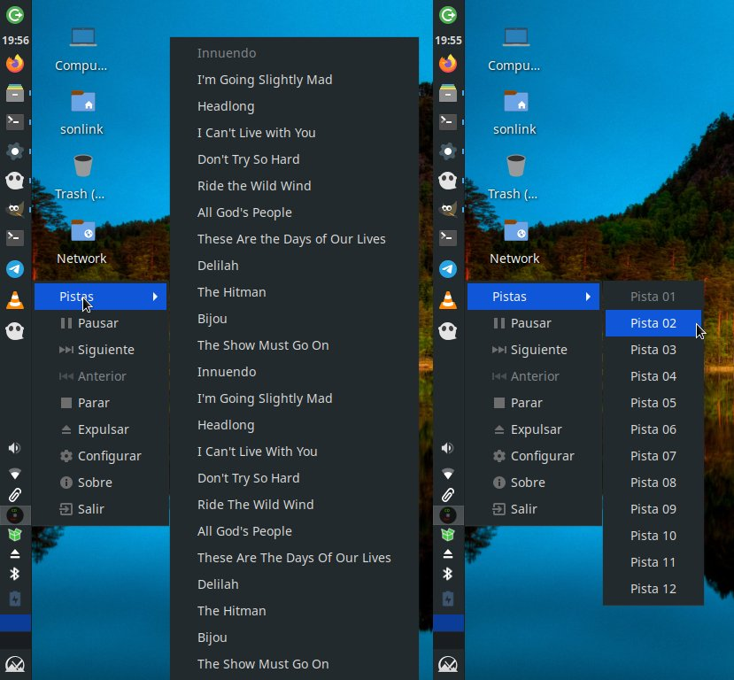

# CD Tray

[https://github.com/son-link/CD-Tray](https://github.com/son-link/CD-Tray)

Play your audio CDs directly from the system tray

&copy; 2012-2023 Alfonso Saavedra "Son Link"

Under GPLv3 License

## Install

### From source code:

* Clone the repo, download the zip under Code -> Download ZIP or download the last release.
* Open a terminal and go to the project folder.
* Install the dependencies:
  * **From PIP** (with administration permissions): `pip install -r requirements.txt`
  * **Debian/Ubuntu/Mint/MX Linux**:
    * apt: `apt install python3 python3-pip python3-pyqt5 python3-gst-1.0 python3-psuti, python3-dbus.mainloop.pyqt5 python3-gi`
	* * If you use **Pipewire** install the package `gstreamer1.0-pipewire` 
  * **Arch Linux/Manjaro**:
    * pacman: `python-pip python-pyqt5 gstreamer gst-plugins-base python-psutil gst-python`
    * If you use **Pipewire** install the package `gst-plugin-pipewire`

  * Copy the icon and desktop file:
    * All users:
      * `install -m 644 bin/io.sonlink.cdtray.desktop /usr/share/applications`
  	  * `install -m 644 bin/io.sonlink.cdtray.svg /usr/share/icons/cdtray.svg`
  	* Current user:
  	  * `cp bin/io.sonlink.cdtray.desktop ~/.local/share/applications`
  	  * `cp bin/io.sonlink.cdtray.svg ~/.icons/cdtray.svg`

### From Pypi:

`pip install cdtray`

* Copy the icon and desktop file:
	* All users:
		* `install -m 644 bin/io.sonlink.cdtray.desktop /usr/share/applications`
		* `install -m 644 bin/io.sonlink.cdtray.svg /usr/share/icons/cdtray.svg`
  	* Current user:
		 * `cp bin/io.sonlink.cdtray.desktop ~/.local/share/applications`
		* `cp bin/io.sonlink.cdtray.svg ~/.icons/cdtray.svg`

### AUR:

If you use Arch Linux, Manjaro, or other Arch Linux base distributions, you can install the official package from [AUR](https://aur.archlinux.org/packages/cdtray)

For example: `yay -S cdtray`

### Executables:

At the moment not available

### Command line options:

* -d | --device <device>: set the device to read the CD from (usually /dev/sr0 or /dev/cdrom)
* -f | --force : if another cdtray instance is running, kill it and start a new one
